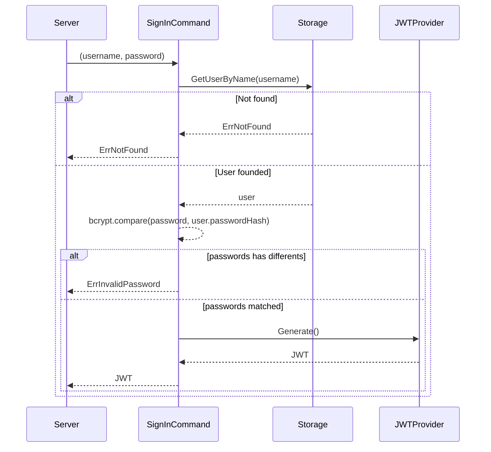
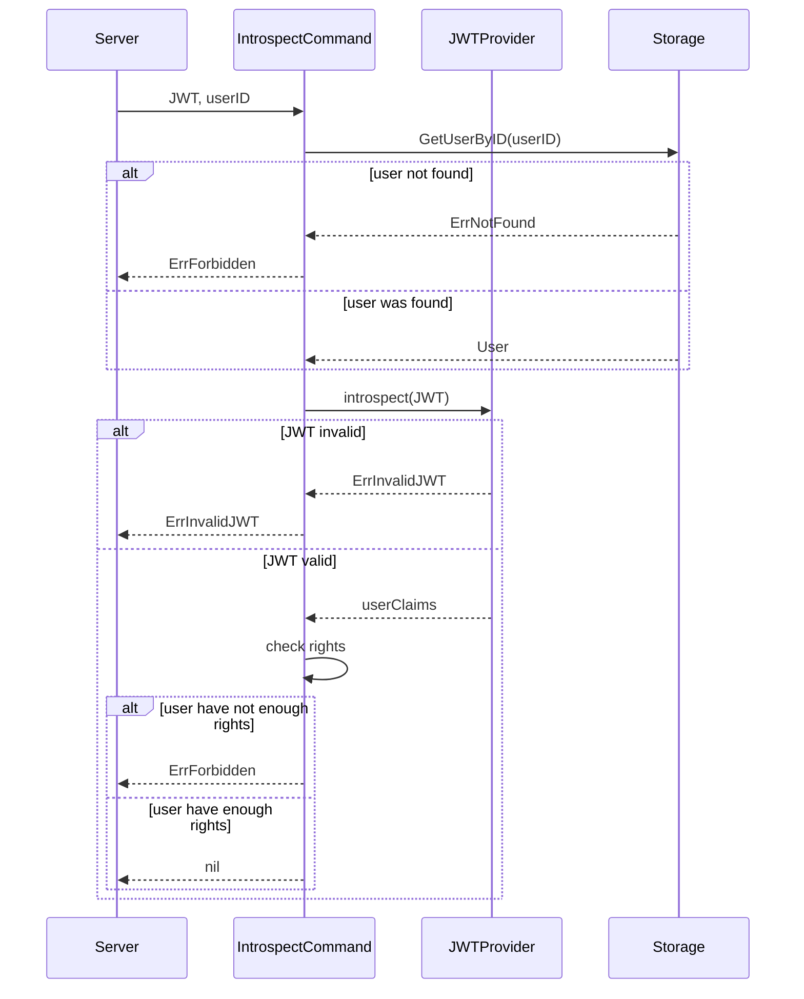

## Диаграмма последовательности при попытке SignIn 

```mermaid
sequenceDiagram
    participant Server
    participant SignInCommand
    participant Storage
    participant JWTProvider

Server ->> SignInCommand: (username, password)
SignInCommand ->> Storage: GetUserByName(username)
alt Not found
    Storage -->> SignInCommand: ErrNotFound
    SignInCommand -->> Server: ErrNotFound
else User founded
    Storage -->> SignInCommand: user
    SignInCommand -->> SignInCommand: bcrypt.compare(password, user.passwordHash)
    alt passwords has differents
        SignInCommand -->> Server: ErrInvalidPassword
    else passwords matched
        SignInCommand ->> JWTProvider: Generate()
        JWTProvider -->> SignInCommand: JWT
        SignInCommand -->> Server: JWT
        END
    END
```

## Диаграмма последовательности при Introspect

```mermaid
sequenceDiagram
    participant Server
    participant IntrospectCommand
    participant JWTProvider
    participant Storage

Server ->> IntrospectCommand: JWT, userID
IntrospectCommand ->> Storage: GetUserByID(userID)
alt user not found
    Storage -->> IntrospectCommand: ErrNotFound
    IntrospectCommand -->> Server: ErrForbidden
else user was found
    Storage -->> IntrospectCommand: User
end
IntrospectCommand ->> JWTProvider: introspect(JWT)
alt JWT invalid
    JWTProvider -->> IntrospectCommand: ErrInvalidJWT
    IntrospectCommand -->> Server: ErrInvalidJWT
else JWT valid
    JWTProvider -->> IntrospectCommand: userClaims
    IntrospectCommand ->> IntrospectCommand: check rights
    alt user have not enough rights
        IntrospectCommand -->> Server: ErrForbidden
    else user have enough rights
        IntrospectCommand -->> Server: nil
    end
end

```