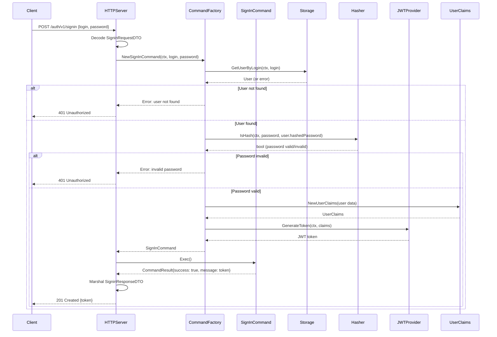
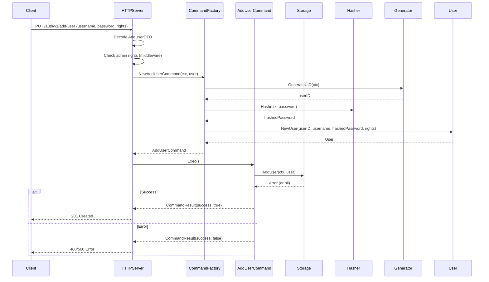
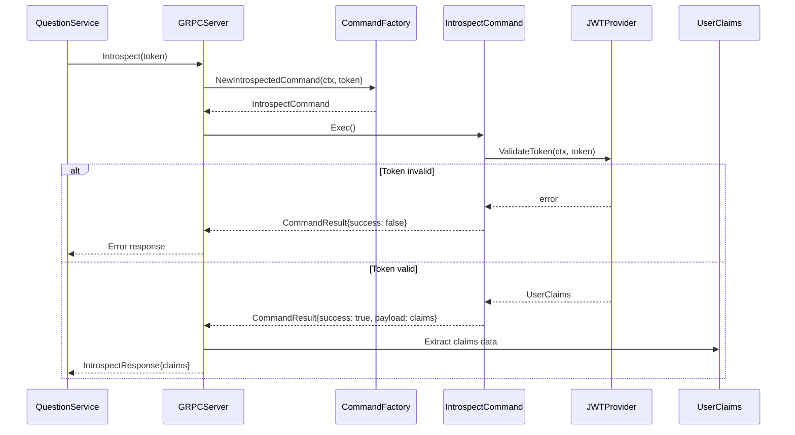
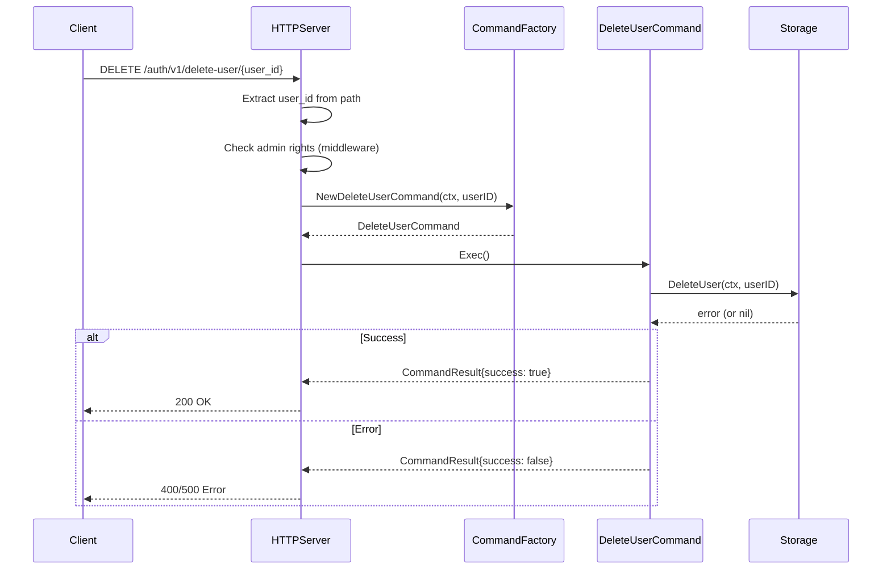
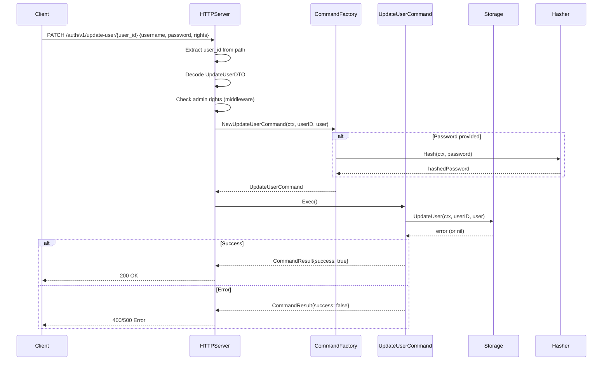
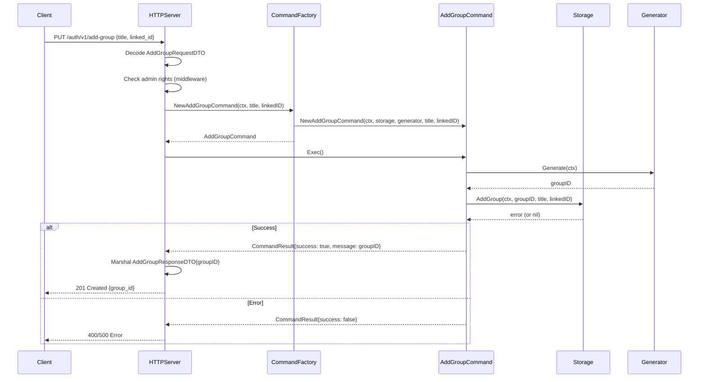

# Auth Service Architecture Documentation

## Обзор

Auth Service является ключевым компонентом системы, отвечающим за аутентификацию и авторизацию пользователей. Сервис построен на основе Clean Architecture и Command Pattern, обеспечивая четкое разделение ответственности между слоями.

## Архитектура

### Диаграмма классов

```mermaid
classDiagram
    %% Core Entities
    class User {
        -id string
        -username string  
        -hashedPassword string
        -rights strings
        +NewUser(id, username, hashedPassword, rights) User
        +ValidateUser() error
        +String() string
    }
    
    class UserClaims {
        -username string
        -issuer string
        -audience strings
        -subject string
        -rights strings
        +NewUserClaims(...) UserClaims
    }
    
    class Command {
        <<interface>>
        +Exec() CommandResult
    }
    
    class CommandResult {
        -success bool
        -message string
        -payload any
        +NewCommandResult(success, message, payload) CommandResult
        +Success bool
        +Message string
        +Payload any
    }
    
    %% Command Factory (Port)
    class CommandFactory {
        <<interface>>
        +NewSignInCommand(ctx, login, password) Command
        +NewAddUserCommand(ctx, user) Command
        +NewDeleteUserCommand(ctx, userID) Command  
        +NewUpdateUserCommand(ctx, userID, user) Command
        +NewAddGroupCommand(ctx, title, linkedID) Command
        +NewIntrospectedCommand(ctx, token) Command
    }
    
    %% Command Factory Implementation
    class CommandFactoryImpl {
        -storage Storage
        -generator Generator
        -jwtProvider JWTProvider
        -hasher Hasher
        +NewCommandFactory(...) CommandFactoryImpl
        +NewSignInCommand(ctx, login, password) Command
        +NewAddUserCommand(ctx, user) Command
        +NewDeleteUserCommand(ctx, userID) Command
        +NewUpdateUserCommand(ctx, userID, user) Command
        +NewAddGroupCommand(ctx, title, linkedID) Command
        +NewIntrospectedCommand(ctx, token) Command
    }
    
    %% Specific Commands
    class AddGroupCommand {
        -storage Storage
        -generator IDGenerator
        -title string
        -linkedID string
        -ctx Context
        +NewAddGroupCommand(ctx, storage, generator, title, linkedID) AddGroupCommand
        +Exec() CommandResult
    }
    
    %% Adapters - Storage
    class Storage {
        <<interface>>
        +GetUserByLogin(ctx, login) User
        +AddUser(ctx, user) error
        +DeleteUser(ctx, userID) error
        +UpdateUser(ctx, userID, user) error
        +AddGroup(ctx, gid, title, mentorID) error
        +GetUserByID(ctx, userID) User
        +Close()
    }
    
    class PostgresStorage {
        -db Pool
        -once Once
        -cancel CancelFunc
        +NewStorage(connectionString, opts) PostgresStorage
        +GetUserByLogin(ctx, login) User
        +AddUser(ctx, user) error
        +DeleteUser(ctx, userID) error
        +UpdateUser(ctx, userID, user) error
        +AddGroup(ctx, gid, title, mentorID) error
        +GetUserByID(ctx, userID) User
        +Close()
    }
    
    %% Adapters - JWT Provider
    class JWTProvider {
        <<interface>>
        +GenerateToken(ctx, claims) string
        +ValidateToken(ctx, token) UserClaims
    }
    
    class JWTProviderImpl {
        -secret bytes
        -aud strings
        -iss string
        -tokenValidityPeriod Duration
        +NewProvider(secret, aud, iss, ttl) JWTProviderImpl
        +GenerateToken(ctx, claims) string
        +ValidateToken(ctx, token) UserClaims
    }
    
    %% Adapters - Hasher
    class Hasher {
        <<interface>>
        +Hash(ctx, pass) string
        +IsHash(ctx, password, hash) bool
    }
    
    class BcryptHasher {
        +NewHasher() BcryptHasher
        +Hash(ctx, pass) string
        +IsHash(ctx, password, hash) bool
    }
    
    %% Adapters - Generator
    class Generator {
        <<interface>>
        +GenerateUID(ctx) string
    }
    
    class GoogleGenerator {
        +NewGenerator() GoogleGenerator
        +GenerateUID(ctx) string
    }
    
    %% HTTP Port
    class HTTPServer {
        -router Mux
        -server Server
        -factory CommandFactory
        -accessor Accessor
        -cfg ServerCfg
        +New(opts) HTTPServer
        +Start()
        +Stop()
        +Signin(resp, req)
        +AddUser(resp, req)
        +DeleteUser(resp, req)
        +UpdateUser(resp, req)
        +AddGroup(resp, req)
    }
    
    %% GRPC Port
    class GRPCServer {
        -factory CommandFactory
        +Introspect(ctx, req) IntrospectResponse
        +Start(port)
        +Stop()
    }
    
    %% DTOs
    class SigninRequestDTO {
        +Login string
        +Password string
    }
    
    class SigninResponseDTO {
        +Token string
    }
    
    class AddUserDTO {
        +Username string
        +Password string
        +Rights strings
    }
    
    class UpdateUserDTO {
        +Username string
        +Password string
        +Rights strings
    }
    
    class AddGroupDTO {
        +Title string
        +LinkedID string
    }
    
    class AddGroupResponseDTO {
        +GroupID string
    }
    
    %% Relations
    CommandFactoryImpl ..|> CommandFactory : implements
    PostgresStorage ..|> Storage : implements
    JWTProviderImpl ..|> JWTProvider : implements
    BcryptHasher ..|> Hasher : implements
    GoogleGenerator ..|> Generator : implements
    
    CommandFactoryImpl --> Storage : uses
    CommandFactoryImpl --> JWTProvider : uses
    CommandFactoryImpl --> Hasher : uses
    CommandFactoryImpl --> Generator : uses
    CommandFactoryImpl --> Command : creates
    CommandFactoryImpl --> AddGroupCommand : creates
    Command --> CommandResult : returns
    AddGroupCommand --> CommandResult : returns
    
    HTTPServer --> CommandFactory : uses
    GRPCServer --> CommandFactory : uses
    
    HTTPServer --> SigninRequestDTO : receives
    HTTPServer --> SigninResponseDTO : returns
    HTTPServer --> AddUserDTO : receives
    HTTPServer --> UpdateUserDTO : receives
    HTTPServer --> AddGroupDTO : receives
    HTTPServer --> AddGroupResponseDTO : returns
    
    JWTProvider --> UserClaims : creates/validates
    Storage --> User : stores/retrieves
```

### Диаграммы последовательностей

#### 1. Процесс входа в систему (Sign In)

#### 2. Добавление пользователя (Add User)

#### 3. Интроспекция токена (Token Introspection)

#### 4. Удаление пользователя (Delete User)

#### 5. Обновление пользователя (Update User)

#### 6. Добавление группы (Add Group)

## Ключевые компоненты

### Entities (Сущности)
- **User**: Основная сущность пользователя с валидацией
- **UserClaims**: JWT claims для хранения информации о пользователе
- **Command**: Интерфейс для команд бизнес-логики
- **CommandResult**: Результат выполнения команды

### Use Cases (Случаи использования)
- **CommandFactory**: Фабрика команд, реализующая бизнес-логику
- Создание команд для всех операций (signin, add user, delete user, etc.)

### Adapters (Адаптеры)
- **PostgresStorage**: Адаптер для работы с PostgreSQL
- **JWTProvider**: Адаптер для работы с JWT токенами
- **BcryptHasher**: Адаптер для хеширования паролей
- **GoogleGenerator**: Адаптер для генерации уникальных ID

### Ports (Порты)
- **HTTP Server**: REST API для внешних клиентов
- **GRPC Server**: gRPC API для внутренних сервисов

## Паттерны проектирования

1. **Clean Architecture**: Четкое разделение на слои
2. **Command Pattern**: Инкапсуляция бизнес-операций в команды
3. **Factory Pattern**: Создание команд через фабрику
4. **Dependency Injection**: Через конструкторы и опции
5. **Repository Pattern**: Абстрация работы с данными

## Безопасность

- Хеширование паролей с использованием bcrypt
- JWT токены для аутентификации
- Проверка прав доступа на уровне middleware
- Валидация входных данных

## API Endpoints

### HTTP API
- `POST /auth/v1/signin` - Вход в систему
- `PUT /auth/v1/add-user` - Добавление пользователя (admin)
- `DELETE /auth/v1/delete-user/{user_id}` - Удаление пользователя (admin)
- `PATCH /auth/v1/update-user/{user_id}` - Обновление пользователя (admin)
- `PUT /auth/v1/add-group` - Добавление группы с названием и ID ментора (admin)

### gRPC API
- `Introspect` - Валидация и извлечение claims из JWT токена
