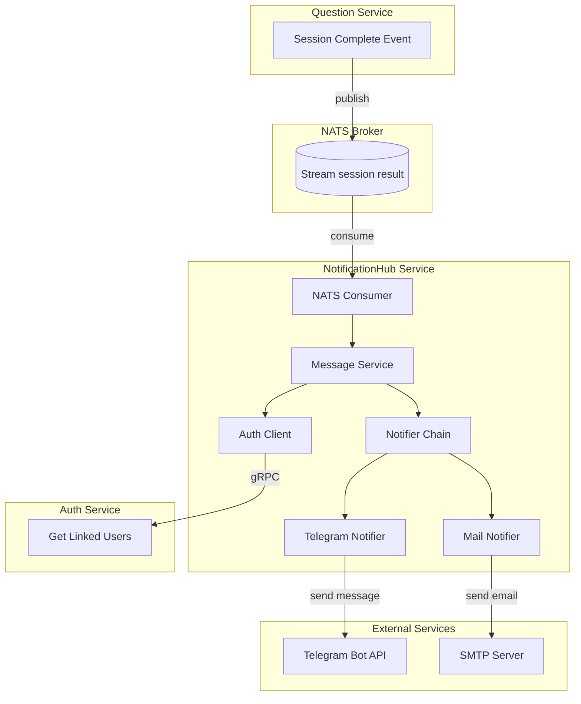
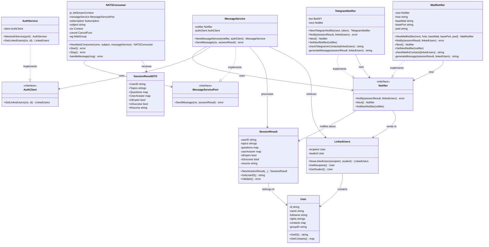
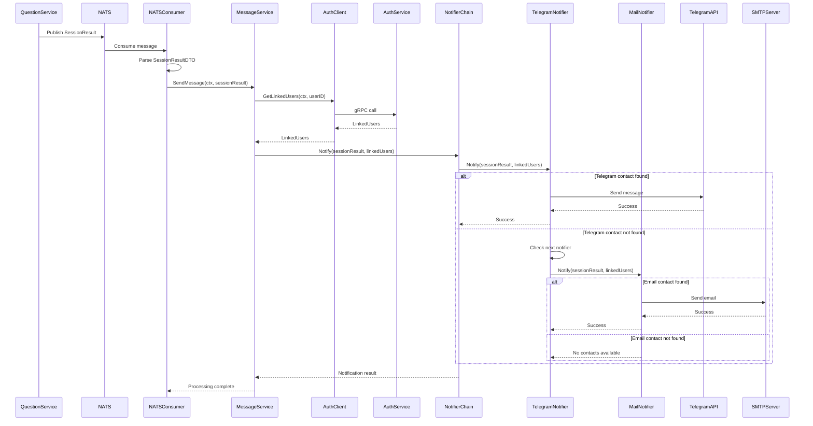
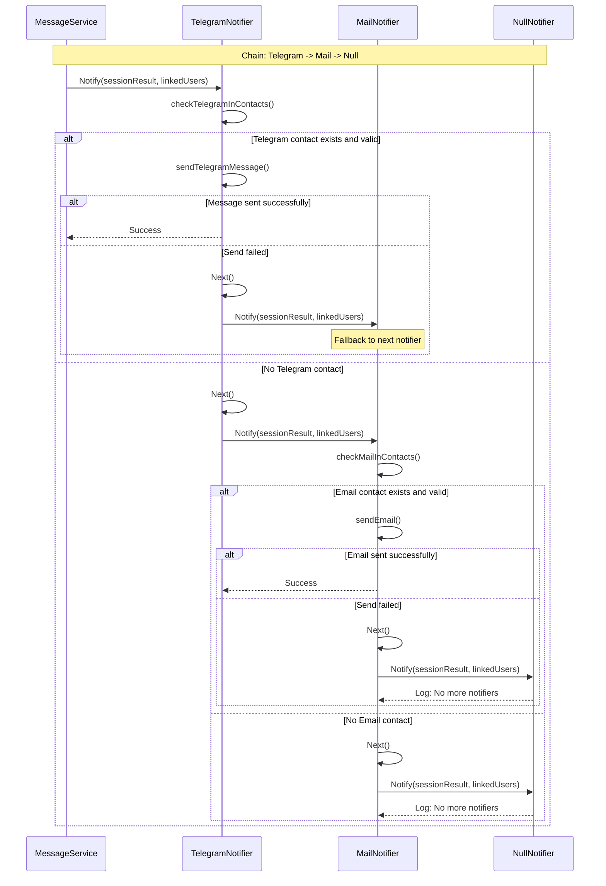
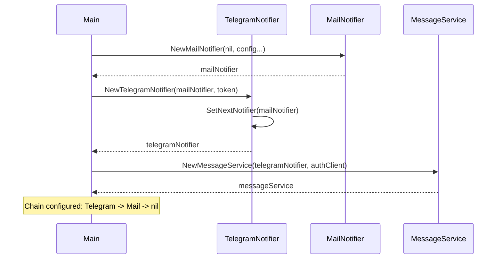

# Архитектура NotificationHub Service

## Введение
NotificationHub Service (далее - сервис уведомлений) является специализированным микросервисом в составе проекта Knowledge Validation System (далее - kvs, erudite), отвечающим за доставку уведомлений о результатах тестирования пользователям системы.

Сервис позволяет:
- Принимать результаты сессий тестирования через NATS брокер;
- Получать информацию о связанных пользователях из Auth Service;
- Отправлять уведомления через различные каналы связи (Telegram, Email);
- Обеспечивать надежную доставку сообщений с использованием паттерна Chain of Responsibility.

## System Design
Сервис построен на основе событийно-ориентированной архитектуры и использует асинхронную обработку сообщений. 
Сервис написан на языке Go.
В качестве точки входа используется NATS Consumer для получения результатов сессий.
Для получения информации о пользователях используется gRPC клиент для обращения к Auth Service.
Для отправки уведомлений реализована цепочка нотификаторов с использованием паттерна Chain of Responsibility.

### Структура сервиса


## Структура проекта

### Диаграмма классов


### Диаграммы последовательностей

#### 1. Основной процесс обработки уведомления



#### 2. Паттерн Chain of Responsibility в действии



#### 3. Инициализация цепочки нотификаторов



## Паттерны проектирования

### Chain of Responsibility (Цепочка обязанностей)

Сервис уведомлений активно использует паттерн Chain of Responsibility для обеспечения надежной доставки сообщений через различные каналы связи.

#### Структура паттерна:

1. **Интерфейс Handler (Notifier)**:
   ```go
   type Notifier interface {
       Notify(sessionResult *entities.SessionResult, linkedUsers *entities.LinkedUsers) error
       Next() Notifier
       SetNextNotifier(notifier Notifier)
   }
   ```

2. **Конкретные обработчики**:
   - `TelegramNotifier` - отправка через Telegram Bot API
   - `MailNotifier` - отправка через SMTP

#### Преимущества использования:

1. **Гибкость**: Легко добавлять новые способы уведомлений
2. **Надежность**: Если один канал недоступен, используется следующий
3. **Разделение ответственности**: Каждый нотификатор отвечает только за свой канал
4. **Конфигурируемость**: Порядок обработчиков настраивается при инициализации

#### Алгоритм работы:

1. MessageService получает результат сессии
2. Вызывает первый нотификатор в цепочке (обычно TelegramNotifier)
3. Нотификатор проверяет наличие контактов для своего канала
4. Если контакты найдены - пытается отправить сообщение
5. При успехе - возвращает успех
6. При неудаче или отсутствии контактов - передает управление следующему нотификатору
7. Процесс повторяется до успешной отправки или исчерпания цепочки

### Другие паттерны:

1. **Dependency Injection**: Внедрение зависимостей через конструкторы
2. **Repository Pattern**: Абстракция работы с внешними сервисами (AuthClient)
3. **Event-Driven Architecture**: Асинхронная обработка событий через NATS
4. **Template Method**: Общая структура обработки сообщений в нотификаторах

## Ключевые компоненты

### Entities (Сущности)
- **SessionResult**: Результат тестирования пользователя
- **LinkedUsers**: Связанные пользователи (студент и получатель уведомлений)
- **User**: Пользователь системы с контактной информацией

### Use Cases (Случаи использования)
- **MessageService**: Основной сервис обработки сообщений
- **Notifier Chain**: Цепочка нотификаторов для отправки уведомлений

### Adapters (Адаптеры)
- **TelegramNotifier**: Адаптер для отправки через Telegram
- **MailNotifier**: Адаптер для отправки через Email
- **AuthService**: Адаптер для получения данных пользователей
- **NATSConsumer**: Адаптер для получения сообщений из NATS

### Ports (Порты)
- **NATS Consumer**: Потребитель сообщений из брокера
- **MessageService Interface**: Интерфейс сервиса сообщений

## Безопасность и Надежность

1. **Graceful Degradation**: При недоступности одного канала используется другой
2. **Error Handling**: Обработка ошибок на каждом уровне цепочки
3. **Logging**: Подробное логирование процесса доставки
4. **Authentication**: Использование токенов для внешних API
5. **Validation**: Проверка входных данных на всех этапах

## Конфигурация

Сервис настраивается через переменные окружения:
- NATS connection settings
- Telegram Bot Token
- SMTP server settings
- Auth Service endpoint

## Мониторинг

Сервис предоставляет логирование для отслеживания:
- Получения сообщений из NATS
- Успешности отправки уведомлений
- Переключений между нотификаторами
- Ошибок в цепочке обработки

Такая архитектура обеспечивает высокую надежность доставки уведомлений и простоту расширения функциональности сервиса.

Необходимо пересмотреть архитекуру сервиса Notificationhub. Почему?
Текущая архитектура подразумевает сложную логику: 
восстановление события из шины; запрос связанных пользователей; обогащение события; цепочка отправки

нужно исключить пункт с походами в другие сервисы, то есть сервис должен работать только как порт и производить отправку на клиенты.
такой подход позволит минимизировать логику обработки события условно: нужно, чтобы мы обрабатывали событие, как срез байт и получателя и все.

то есть, большую часть логики надо перенести на reporting сервис, пусть он ходит по другим сервисам и собирает нужную инфу, потом, пережимает ее в события и отправляет на notify
