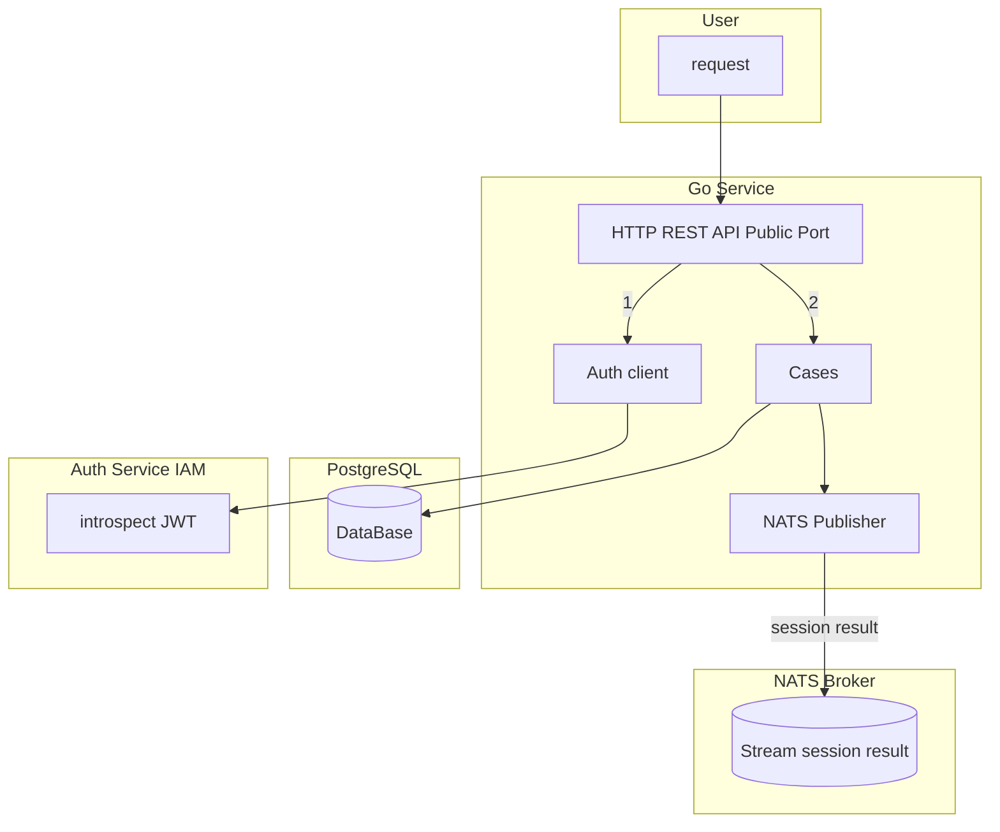
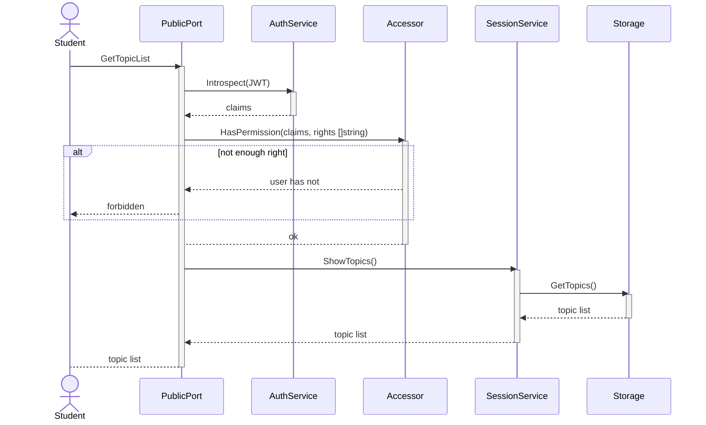
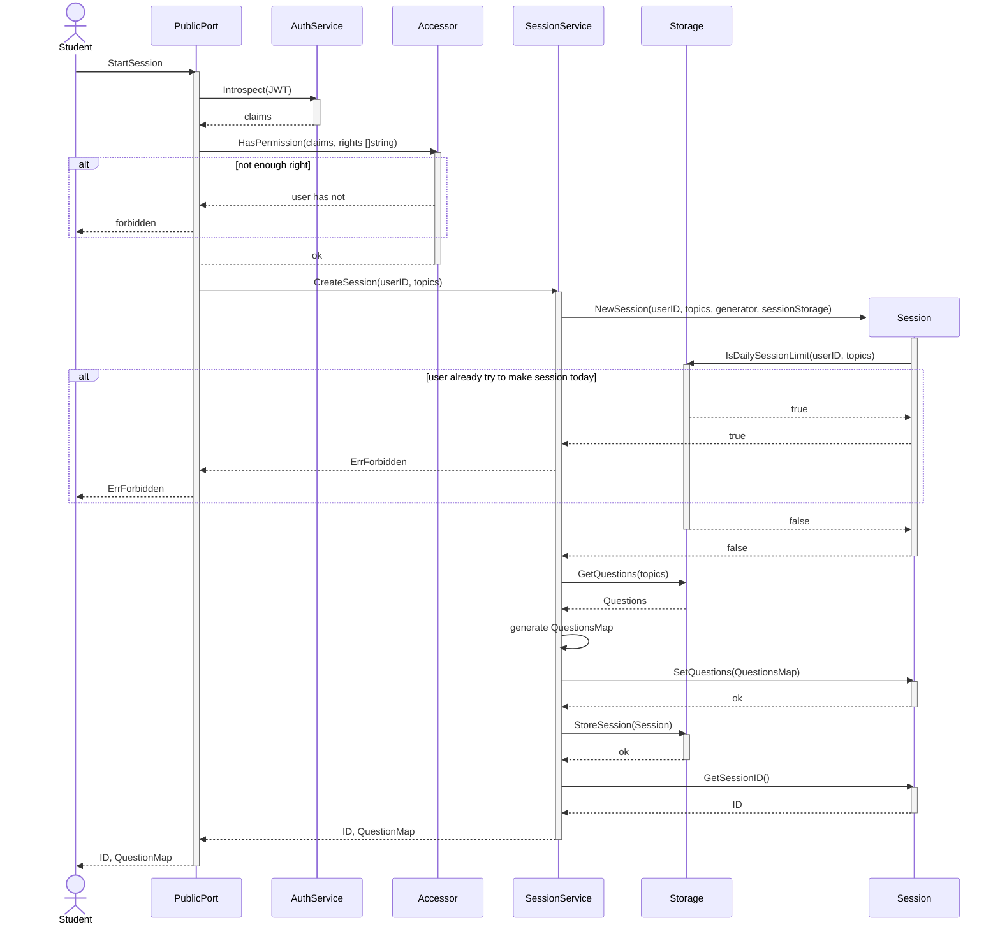
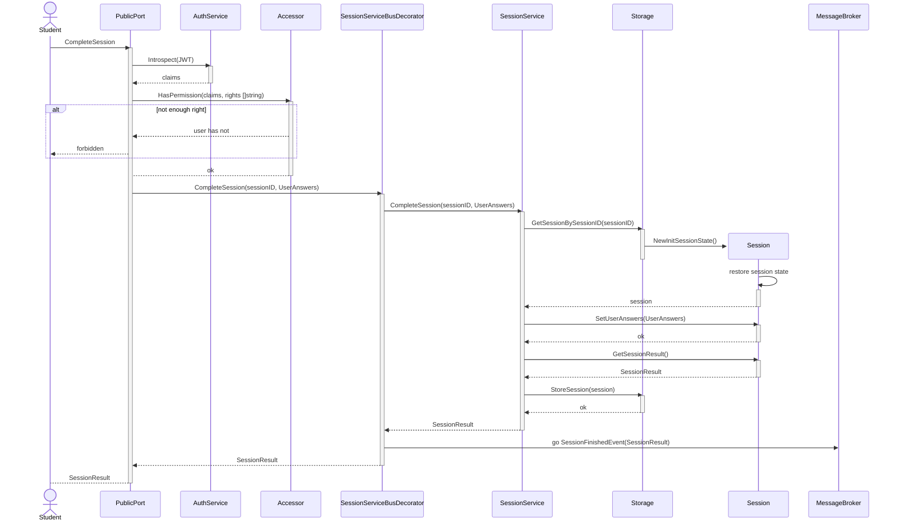
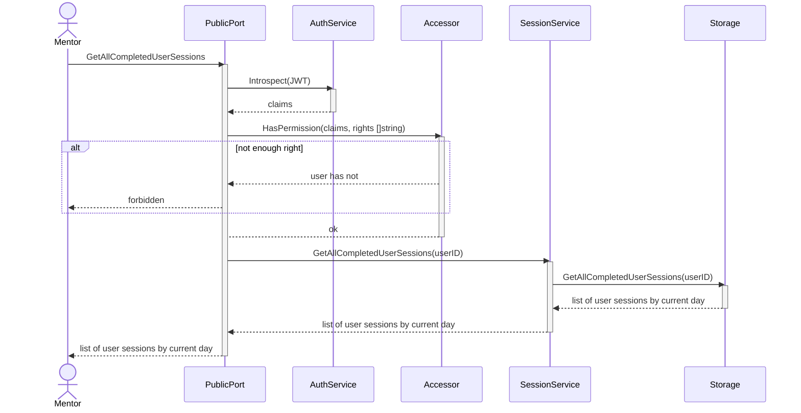

# Архитектура Question service

## Введение
Question service (далее - сервис) является основой бизнес логики проекта Knowledge Validation System (далее - kvs, erudite).
Сервис позволяет пользователям:
- Запрашивать список тем;
- Создавать сессию для заданных тем;
- Загружать ответы пользователя;
- Вычислять результаты и формировать заключение о том, сдал ли студент сессию или нет;

## System Design
Сервис не предполагает интенсивного использования, и вопросы, связанные с распределением нагрузки и оптимизации, будут рассматриваться в порядке их поступления. 
Сервис написан на языке Go. 
В качестве точки входа используется публичный HTTP REST API.
Для проверки правомерности операций используются JWT и интроспекция на Auth service (далее - iam) сервисе. 
В качестве хранилища используется СУБД PostgreSQL. 
Результаты сессии публикуются посредством брокера NATS в стрим с сессиями.
### Структура сервиса

## Структура проекта
### Диаграмма классов

```mermaid
classDiagram
    SingleSelectionQuestion --|> Question
    MultiSelectionQuestion --|> Question
    TrueOrFalseSelectionQuestion --|> Question

	QuestionFactory ..> Question: create

    Session --o SessionState
    Session --|> StateHolder
    Session --o IDGenerator
    InitSessionState --|> SessionState
    ActiveSessionState --|> SessionState
    CompletedSessionState --|> SessionState

    InitSessionState --o SessionStorage
    InitSessionState --o StateHolder
    ActiveSessionState --o StateHolder
    ActiveSessionState --o Question
    CompletedSessionState --o UserAnswer
    CompletedSessionState --o Question
    Session ..> SessionResult: create

    SessionServiceBase --o Storage
    SessionServiceBase --o SessionStorage
    SessionServiceBase --o IDGenerator
	SessionServiceBase --|> SessionService

	SessionServiceBusDecorator --o MessageBroker
	SessionServiceBusDecorator --o SessionService
	SessionServiceBusDecorator --|> SessionService

	Nats --|> MessageBroker
	
	Postgres --|> Storage
	Postgres --|> SessionStorage
	Postgres --o QuestionFactory

	Uint64Generator --|> IDGenerator

	PublicServer --o SessionService
	PublicServer --o AuthClient
	PublicServer --o Accessor

    namespace entities {
        class Question{
            <<interface>>
            +ID() string
	        +Type() QuestionType
	        +Topic() string
	        +Subject() string
	        +Variants() []string
	        +IsAnswerCorrect(ans *UserAnswer) bool
        }
        class SingleSelectionQuestion{
            -id            string
	        -topic         string
	        -subject       string
	        -variants      []string
	        -correctAnswer string
            
            +ID() string
	        +Type() QuestionType
	        +Topic() string
	        +Subject() string
	        +Variants() []string
	        +IsAnswerCorrect(ans *UserAnswer) bool
        }

        class MultiSelectionQuestion{
            -id            string
	        -topic         string
	        -subject       string
	        -variants      []string
	        -correctAnswer []string
            
            +ID() string
	        +Type() QuestionType
	        +Topic() string
	        +Subject() string
	        +Variants() []string
	        +IsAnswerCorrect(ans *UserAnswer) bool
        }

        class TrueOrFalseSelectionQuestion {
            -id            string
	        -topic         string
	        -subject       string
	        -correctAnswer bool
            
            +ID() string
	        +Type() QuestionType
	        +Topic() string
	        +Subject() string
	        +Variants() []string
	        +IsAnswerCorrect(ans *UserAnswer) bool
        }

		class QuestionFactory{
			+NewQuestion(id string, questionType QuestionType, topic string, subject string, variants []string, correctAnswer []string) (Question, error)
		}

        class Session {
	        -userID    string
	        -sessionID string
	        -topics    []string
	        -state SessionState

            +ChangeState(state SessionState)
            +GetQuestions() ([]Question, error)
            +GetSessionID() string
            +GetSessionDurationLimit() (time.Duration, error)
            +GetSessionResult() (*SessionResult, error)
            +GetStartedAt() (time.Time, error)
            +GetStatus() string
            +GetTopics() []string
            +GetUserAnswers() ([]*UserAnswer, error)
            +GetUserID() string
            +IsDailySessionLimitReached() bool
            +SetQuestions(qestions map[string]Question, duration time.Duration) error
            +SetUserAnswer(answers []*UserAnswer) error
        }

        class SessionState{
            <<interface>>
	        GetStatus() string
	        GetQuestions() ([]Question, error)
	        GetStartedAt() (time.Time, error)
	        GetUserAnswers() ([]*UserAnswer, error)
	        SetQuestions(qestions map[string]Question, duration time.Duration) error
	        SetUserAnswer(answers []*UserAnswer) error
	        GetSessionResult() (*SessionResult, error)
	        GetSessionDurationLimit() (time.Duration, error)
	        IsExpired() (bool, error)
	        IsDailySessionLimitReached(ctx context.Context, userID string, topics []string) (bool, error)
        }

        class StateHolder {
            <<interface>>
	        ChangeState(state SessionState)
        }

        class InitSessionState {
	        -stateHolder    StateHolder
	        -sessionStorage SessionStorage
            
            GetStatus() string
	        GetQuestions() ([]Question, error)
	        GetStartedAt() (time.Time, error)
	        GetUserAnswers() ([]*UserAnswer, error)
	        SetQuestions(qestions map[string]Question, duration time.Duration) error
	        SetUserAnswer(answers []*UserAnswer) error
	        GetSessionResult() (*SessionResult, error)
	        GetSessionDurationLimit() (time.Duration, error)
	        IsExpired() (bool, error)
	        IsDailySessionLimitReached(ctx context.Context, userID string, topics []string) (bool, error)
        }

        class ActiveSessionState {
	        -holder    StateHolder
	        -questions map[string]Question
	        -startedAt time.Time
	        -duration  time.Duration
            
            GetStatus() string
	        GetQuestions() ([]Question, error)
	        GetStartedAt() (time.Time, error)
	        GetUserAnswers() ([]*UserAnswer, error)
	        SetQuestions(qestions map[string]Question, duration time.Duration) error
	        SetUserAnswer(answers []*UserAnswer) error
	        GetSessionResult() (*SessionResult, error)
	        GetSessionDurationLimit() (time.Duration, error)
	        IsExpired() (bool, error)
	        IsDailySessionLimitReached(ctx context.Context, userID string, topics []string) (bool, error)
        }

        class CompletedSessionState {
	        -questions map[string]Question
	        -answers   []*UserAnswer
	        -holder    StateHolder
	        -startedAt time.Time
	        -isExpired bool
            
            GetStatus() string
	        GetQuestions() ([]Question, error)
	        GetStartedAt() (time.Time, error)
	        GetUserAnswers() ([]*UserAnswer, error)
	        SetQuestions(qestions map[string]Question, duration time.Duration) error
	        SetUserAnswer(answers []*UserAnswer) error
	        GetSessionResult() (*SessionResult, error)
	        GetSessionDurationLimit() (time.Duration, error)
	        IsExpired() (bool, error)
	        IsDailySessionLimitReached(ctx context.Context, userID string, topics []string) (bool, error)
        }

        class IDGenerator {
            <<interface>>
	        GenerateID() string
        }

        class SessionStorage {
            <<interface>>
	        IsDailySessionLimitReached(ctx context.Context, userID string, topics []string) (bool, error)
        }

        class UserAnswer {
	        -questionID string
	        -answer     []string

            +GetQuestionID() string
            +GetSelections() []string
        }

        class SessionResult{
	        UserID      string
	        Topics      []string
	        Questions   map[string][]string
	        UserAnswers map[string][]string
	        IsExpire    bool
	        IsSuccess   bool
	        Grade       string
        }
    }

    namespace cases {
        class Storage {
            <<interface>>
	        +GetTopics(ctx context.Context) ([]string, error)
	        +GetQuestions(ctx context.Context, topics []string) ([]entities.Question, error)
	        +StoreSession(ctx context.Context, session *entities.Session) error
	        +GetSessionBySessionID(ctx context.Context, sessionID string) (*entities.Session, error)
	        +GetAllCompletedUserSessions(ctx context.Context, userID string) ([]*entities.Session, error)
        }

        class MessageBroker {
            <<interface>>
	        +SessionFinishedEvent(ctx context.Context, sessionResult *entities.SessionResult) error
        }

		class SessionService {
			<<interface>>
			+CompleteSession(ctx context.Context, sessionID string, answers []*entities.UserAnswer) (*entities.SessionResult, error)
			+CreateSession(ctx context.Context, userID string, topics []string) (string, map[string]entities.Question, error)
			+GetAllCompletedUserSessions(ctx context.Context, userID string) ([]*entities.Session, error)
			+ShowTopics(ctx context.Context) ([]string, error)
		}

        class SessionServiceBase {
	        -storage        Storage
	        -sessionStorage entities.SessionStorage
	        -generator      entities.IDGenerator
	        -topicDuration  time.Duration
            +CompleteSession(ctx context.Context, sessionID string, answers []*entities.UserAnswer) (*entities.SessionResult, error)
            +CreateSession(ctx context.Context, userID string, topics []string) (string, map[string]entities.Question, error)
            +GetAllCompletedUserSessions(ctx context.Context, userID string) ([]*entities.Session, error)
            +ShowTopics(ctx context.Context) ([]string, error)
        }

		class SessionServiceBusDecorator {
			-sessionService SessionService
			-messageBroker  MessageBroker
			-timeoutEvent   time.Duration
			+CompleteSession(ctx context.Context, sessionID string, answers []*entities.UserAnswer) (*entities.SessionResult, error)
            +CreateSession(ctx context.Context, userID string, topics []string) (string, map[string]entities.Question, error)
            +GetAllCompletedUserSessions(ctx context.Context, userID string) ([]*entities.Session, error)
            +ShowTopics(ctx context.Context) ([]string, error)		
		}
    }

	namespace adapters {
		class Nats {
			-conn nats.Connection
			-stram string
			+SessionFinishedEvent(ctx context.Context, sessionResult *entities.SessionResult) error
		}

		class Postgres {
			-conn             postgres.Connection
			-questionFactory *entities.QuestionFactory

			+GetAllCompletedUserSessions(ctx context.Context, userID string) ([]*entities.Session, error)
			+GetQuestions(ctx context.Context, topics []string) ([]entities.Question, error)
			+GetSessionBySessionID(ctx context.Context, sessionID string) (*entities.Session, error)
			+GetTopics(ctx context.Context) ([]string, error)
			+IsDailySessionLimitReached(ctx context.Context, userID string, topics []string) (bool, error)
			+StoreSession(ctx context.Context, session *entities.Session) error
		}

		class Uint64Generator {
			+GenerateID() string
		}

		class AuthClient {
			-client *client.AuthClient
			+Introspect(ctx context.Context, jwt string) (*entities.Claims, error)
		}
	}

	namespace ports {
		class PublicServer{
			-router       *chi.Mux
			-server       *http.Server
			-service      Service
			-introspector Introspector
			-accessor     Accessor
			+CompleteSession(resp http.ResponseWriter, req *http.Request)
			+GetAllCompletedUserSessions(resp http.ResponseWriter, req *http.Request)
			+GetTopics(resp http.ResponseWriter, req *http.Request)
			+StartSession(resp http.ResponseWriter, req *http.Request)
		}
		class Accessor{
			<<interface>>
			+HasPermission(ctx context.Context, rights []string) (bool, error)
		}
	}
```

### Диаграммы последовательностей
#### Диаграмма запроса списка тем

#### Диаграмма создания сессии

#### Диаграмма завершения сессии

#### Диаграмма загрузки всех сессий студента

