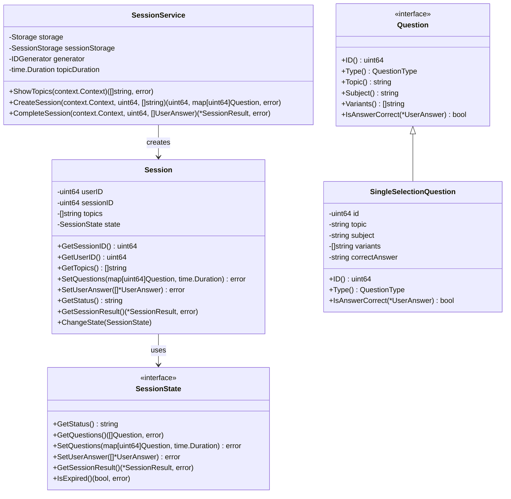
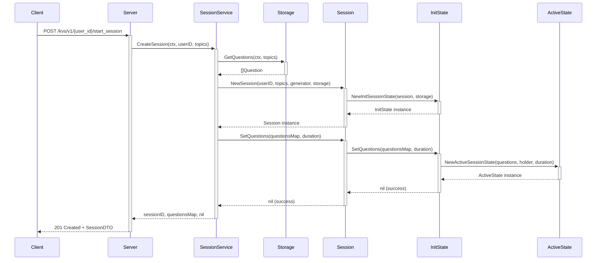
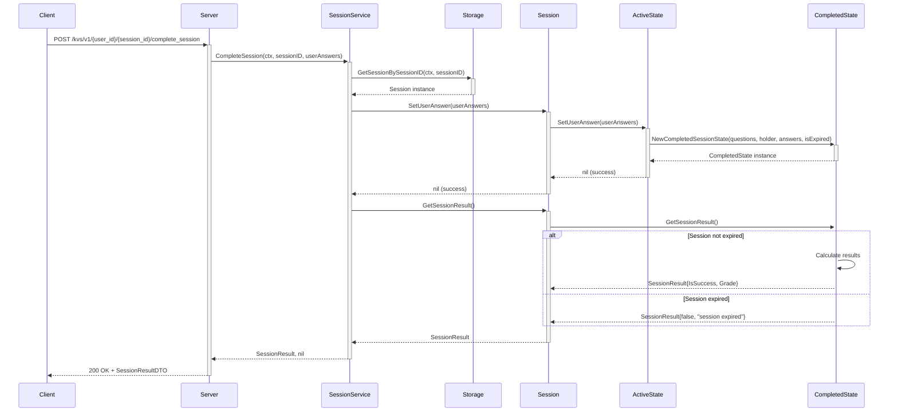
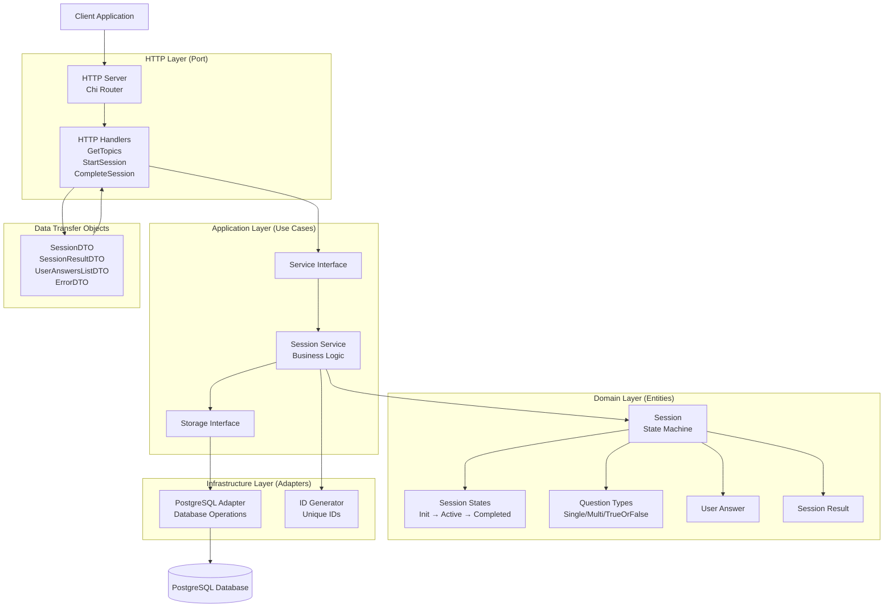
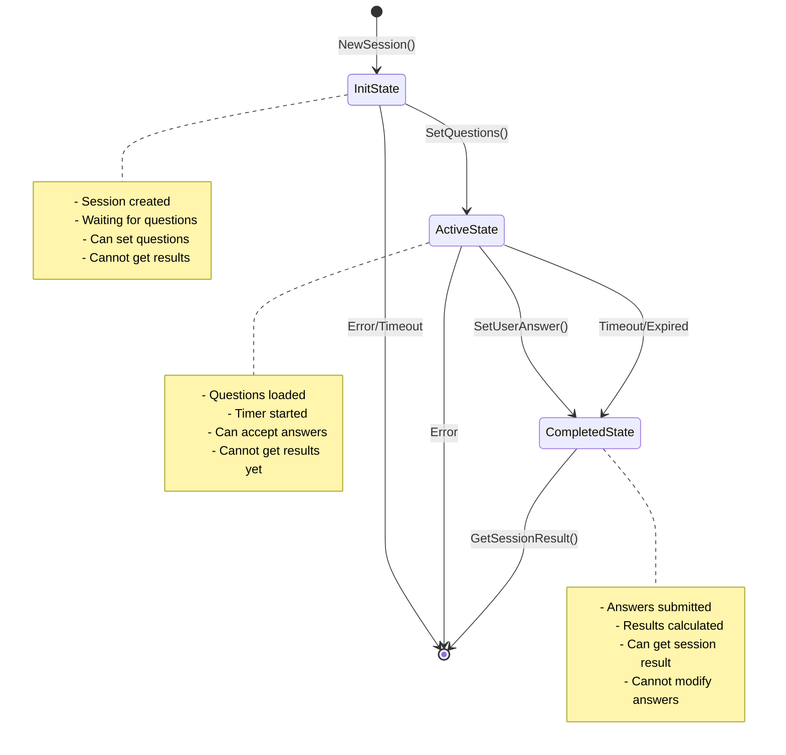
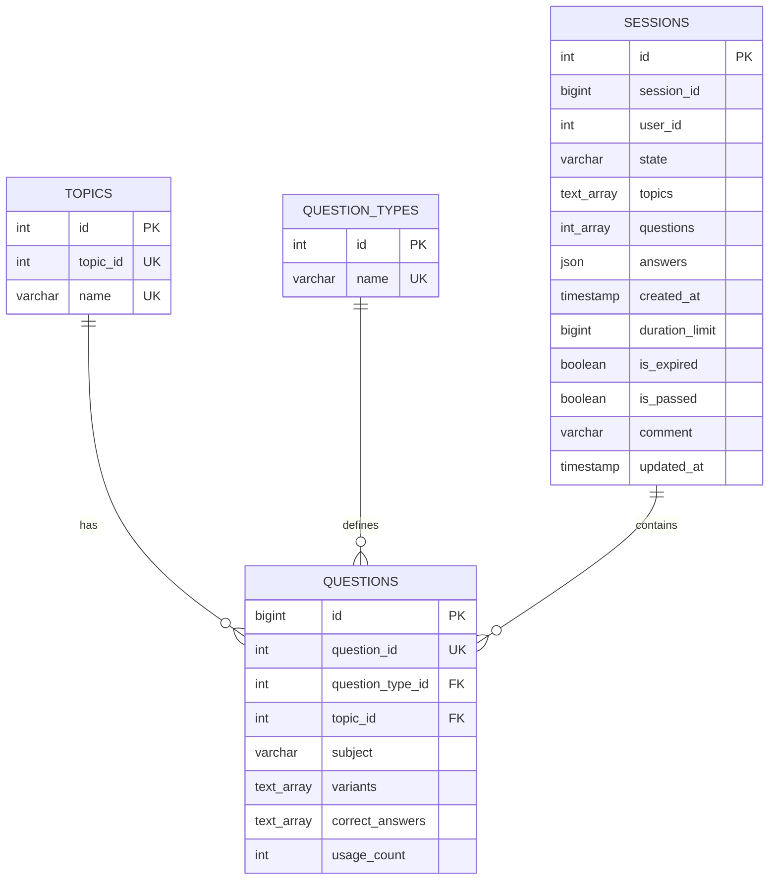
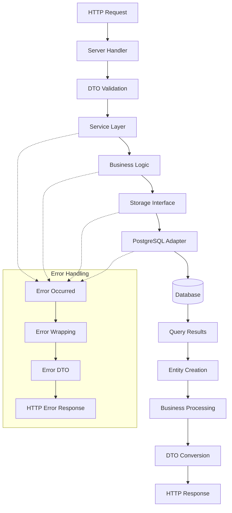

# Диаграммы Knowledge Validation Service

Этот документ содержит все архитектурные диаграммы системы, созданные с помощью Mermaid.

## 📊 Диаграмма классов

Показывает структуру основных сущностей системы и их взаимосвязи:

## 🔄 Диаграмма последовательности - Создание сессии

Показывает поток создания новой тестовой сессии:

## 🏁 Диаграмма последовательности - Завершение сессии

Показывает поток завершения сессии и подсчета результатов:

## 🏗️ Диаграмма архитектуры системы

Показывает общую архитектуру и взаимодействие компонентов:

## 🔄 State Machine диаграмма

Показывает жизненный цикл сессии и переходы между состояниями:

## 🗄️ Диаграмма базы данных

Показывает структуру базы данных и связи между таблицами:

## 📊 Диаграмма потоков данных

Показывает, как данные перемещаются через систему:

## 🔧 Как использовать диаграммы

1. **Для понимания архитектуры** - начните с диаграммы компонентов
2. **Для изучения потоков** - используйте диаграммы последовательности
3. **Для понимания данных** - изучите диаграмму классов и ER-диаграмму
4. **Для отладки состояний** - обратитесь к State Machine

## 📝 Обновление диаграмм

При изменении архитектуры обновляйте соответствующие диаграммы:

1. Отредактируйте Mermaid код в этом файле
2. Проверьте корректность синтаксиса
3. Обновите документацию при необходимости

Диаграммы можно просматривать в любом редакторе с поддержкой Mermaid или на [mermaid.live](https://mermaid.live).
