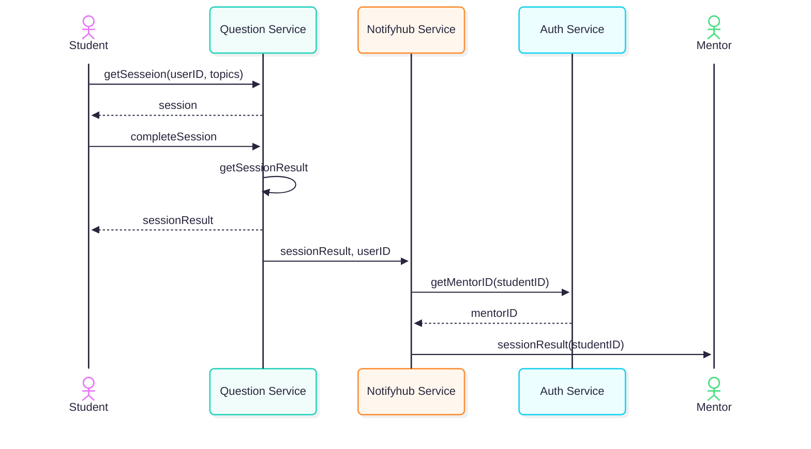

# Base case

```mermaid
---
config:
  look: neo
  theme: redux-color
---
sequenceDiagram
  actor S as Student
  participant Q as Question Service
  participant N as Notifyhub Service
  participant A as Auth Service
  actor M as Mentor
  S ->> Q: getSesseion(userID, topics)
  Q -->> S: session
  S ->> Q: completeSession
  Q ->> Q: getSessionResult
  Q -->> S: sessionResult
  Q ->> N: sessionResult, userID
  N ->> A: getMentorID(studentID)
  A -->> N: mentorID
  N ->> M: sessionResult(studentID)
```