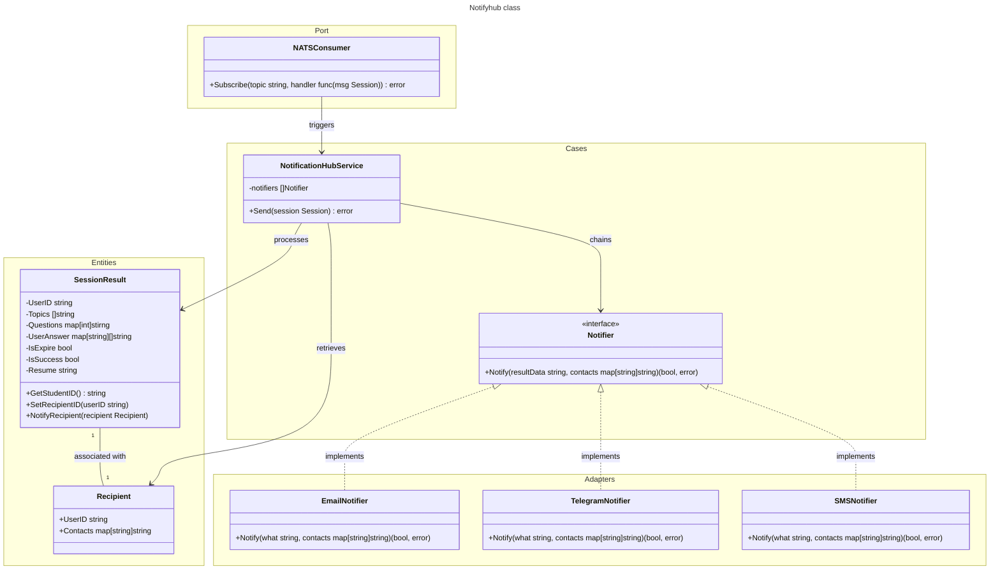
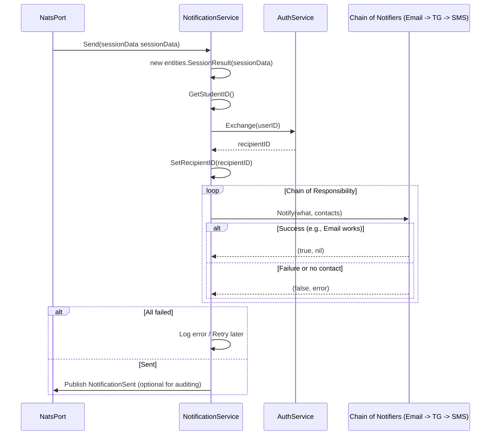

```mermaid
---
title: Notifyhub class
---
classDiagram
    namespace Entities {
        class SessionResult{
            -UserID string
            -Topics []string
            -Questions map[int]stirng
            -UserAnswer map[string][]string
            -IsExpire bool
            -IsSuccess bool
            -Resume string
            
            +GetStudentID() string
            +SetRecipientID(userID string)
            +NotifyRecipient(recipient Recipient)
        }

        class Recipient{
            +UserID string
            +Contacts map[string]string
        }
    }
    namespace Cases {
        class Notifier {
            <<interface>>
            +Notify(resultData string, contacts map[string]string) (bool, error)
        }

        class NotificationHubService {
            -notifiers []Notifier
            +Send(session Session) error
        }
    }
    
    namespace Adapters {
        class EmailNotifier {
        +Notify(what string, contacts map[string]string) (bool, error)
        }

        class TelegramNotifier {
            +Notify(what string, contacts map[string]string) (bool, error)
        }

        class SMSNotifier {
            +Notify(what string, contacts map[string]string) (bool, error)
        }
    }

    
    namespace Port {
        class NATSConsumer {
        +Subscribe(topic string, handler func(msg Session)) error
        }
    }
    

    NotificationHubService --> SessionResult : processes
    NotificationHubService --> Recipient : retrieves
    NotificationHubService --> Notifier : chains
    Notifier <|.. EmailNotifier : implements
    Notifier <|.. TelegramNotifier : implements
    Notifier <|.. SMSNotifier : implements
    NATSConsumer --> NotificationHubService : triggers
    SessionResult "1" -- "1" Recipient : associated with
```

```mermaid
sequenceDiagram
    participant P AS NatsPort
    participant N AS NotificationService
    participant A AS AuthService
    participant Notifiers as Chain of Notifiers (Email -> TG -> SMS)

    P->>N: Send(sessionData sessionData)
    N ->> N: new entities.SessionResult(sessionData) 
    N ->> N: GetStudentID()
    N->>A: Exchange(userID)
    A-->>N: recipientID
    N->>N: SetRecipientID(recipientID)
    loop Chain of Responsibility
        N->>Notifiers: Notify(what, contacts)
        alt Success (e.g., Email works)
            Notifiers-->>N: (true, nil)
        else Failure or no contact
            Notifiers-->>N: (false, error)
        end
    end
    alt All failed
        N->>N: Log error / Retry later
    else Sent
        N->>P: Publish NotificationSent (optional for auditing)
    end
```