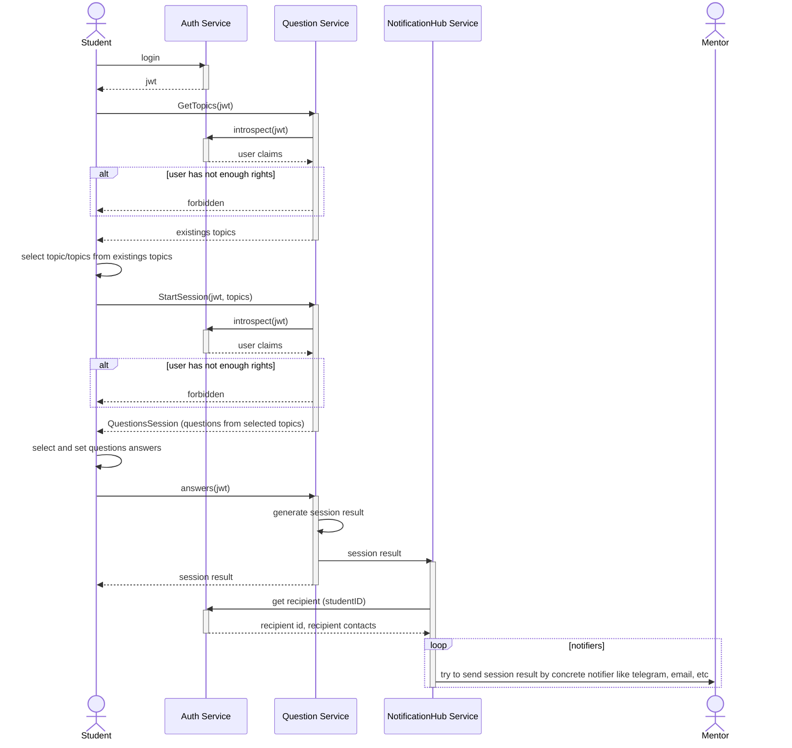

# Erudite — Study & Self-Testing Platform

**Erudite** — это open-source платформа для самопроверки и персонального обучения студентов, поддерживающая сценарии генерации тестов, отслеживания прогресса и анализа пробелов в знаниях.

---
## Задачи
- Внедрение в процесс обучения с целью минимизации временных затрат на проверку базовых знаний студента

## Обобзенный сценарий тестирования для студента

## Возможности
- Автоматическая генерация тестовых сессий по выбранным темам
- Поддержка разных типов вопросов: одиночный выбор; множественный выбор; true/false
- Ограничение времени на выполнение сессии
- Расчет оценки и настройка порога успешной сдачи сессии
- Создание/удаление пользователей, наделение пользователей правами

## Контракты
- Open API/gRPC спецификации сервисов можно найти в папке API в корне проекта: './api'

## Особенности
- Используйте миграции для создания новых топиков и вопросов, аналогично, для создания первоначального администратора и/или других пользователей
- Реализована простая система аутентификации и авторизации
- Внедрены роли (набор прав на выполнение определенных операций)
- Существует всего 3 роли: Администратор, Ментор, Студент
- Только Администратор имеет право на создание и удаление новых пользователей
- Администратор и Ментор имеют права на получение данных по всем завершенным сессиям
- Все типы пользователей имеют права на просмотр топико, запуск сессий и их завершение
- Код покрыт юнит-тестами, L1-тестами (используется контейнер с БД), L2-тестами (все контейнеры задействуются)

## Стек и технологии
- Основной язык - Go ver 1.24
- База данных - PostgreSQL ver 16
- Линтер - golangci-lint ver 2
- Контейнеризация - Docker
- Межсетевое взаимодействие - REST API, gRPC
- CI - Github Actions
- Автоматизация - Task

## Планы
- Внедрение сервиса оповещения для менторов с использованием телеграм
- Расширение observability, в т.ч добавление распределенных трассировок, мониторинга метрик
- Расширение контрактов для возможности быстрого добавления вопросов и тем
- Адаптация базового сценария использования сервиса в телеграм

# Контакты
e-mail: parta4ok@google.com
---