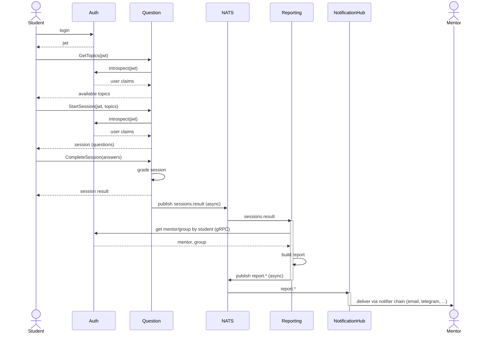

# Erudite — Study & Self-Testing Platform

Backend-платформа для самопроверки и персонального обучения студентов: генерация тестовых сессий по темам, проверка ответов, уведомления и отчётность для менторов.

## Архитектура

Четыре независимых Go-сервиса, взаимодействующих синхронно (REST/gRPC) и асинхронно (NATS):

- **Auth** — аутентификация (JWT), пользователи, группы, права доступа
- **Question** — темы, вопросы, тестовые сессии, генерация результата
- **Reporting** — формирование отчётов для менторов по завершённым сессиям
- **NotificationHub** — доставка уведомлений (email, Telegram)

### Сценарий прохождения теста



Question ничего не знает о Reporting и NotificationHub напрямую — оба подписаны на события в NATS и обрабатывают их независимо.

## Возможности

- Автоматическая генерация тестовых сессий по выбранным темам
- Типы вопросов: одиночный выбор, множественный выбор, true/false
- Ограничение времени на выполнение сессии, порог успешной сдачи
- Управление пользователями и группами: создание/удаление пользователей, назначение прав
- Отчёты для менторов по пройденным темам студентов
- Уведомления о результатах сессии через цепочку нотификаторов (email, Telegram)
- Распределённая трассировка запросов (OpenTelemetry + Jaeger)

## Права доступа

- Права выдаются пользователю явно при создании и хранятся как произвольный набор строк
- На уровне соглашения выделяются 3 роли: администратор, ментор, студент
- Администратор — единственный, кто может создавать, удалять и изменять пользователей, создавать группы
- Ментор — получает отчёты по студентам своей группы
- Базовые права (просмотр тем, запуск и завершение сессии) доступны всем аутентифицированным пользователям

## Контракты

OpenAPI/gRPC-спецификации сервисов — в [`./api`](./api).

## Стек

- Go 1.25
- PostgreSQL 16
- NATS (JetStream) — асинхронный обмен событиями между сервисами
- REST (chi) и gRPC — синхронное межсервисное взаимодействие
- OpenTelemetry + Jaeger — распределённая трассировка
- golangci-lint 2
- Docker / docker-compose
- GitHub Actions — CI
- Task — автоматизация команд разработки

## Тестирование

- Unit-тесты — без внешних зависимостей
- L1 — с поднятым контейнером БД (`task l1_test`)
- L2 — с полным стендом сервисов и инфраструктуры (`task l2_test`)

## Быстрый старт

```bash
task services:run
```

Поднимутся все backend-сервисы, PostgreSQL, NATS и Jaeger, применятся миграции.

- Auth API: http://localhost:8090
- Question API: http://localhost:8080
- Reporting API: http://localhost:8070
- Jaeger UI: http://localhost:16686

### Учётная запись администратора по умолчанию

- Логин: `admin@kvs.ru`
- Пароль: `password123`

> Frontend разрабатывается в отдельном репозитории и не входит в этот проект.

## Планы

- CQRS для Reporting: локальная read-модель вместо синхронных запросов к Question (в разработке)
- Мониторинг метрик
- Расширение контрактов для быстрого добавления вопросов и тем
- Взаимодействие со студентом через Telegram-бота

## Лицензия

[MIT](./LICENSE)

## Контакты

parta4ok@google.com
