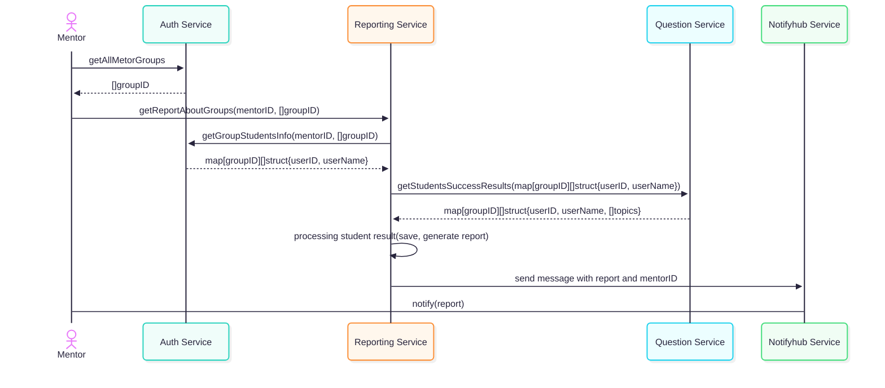
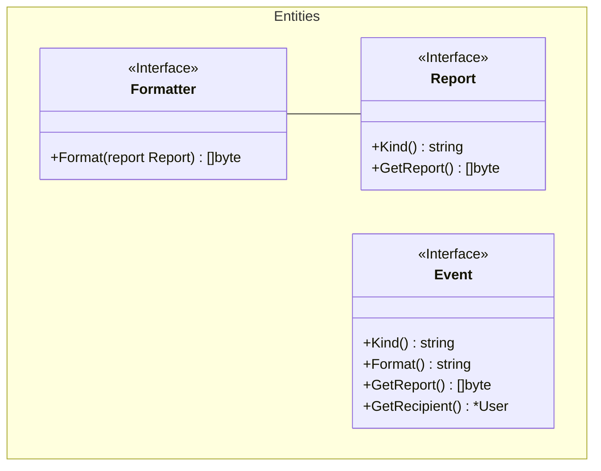

# Base case

```mermaid
---
config:
  look: neo
  theme: redux-color
---
sequenceDiagram
  actor M as Mentor
  participant A as Auth Service
  participant R as Reporting Service
  participant Q as Question Service
  participant N as Notifyhub Service
  
  M ->> A: getAllMetorGroups
  A -->> M: []groupID 

  M ->> R: getReportAboutGroups(mentorID, []groupID)
  R ->> A: getGroupStudentsInfo(mentorID, []groupID)
  A -->>R: map[groupID][]struct{userID, userName}
  R ->> Q: getStudentsSuccessResults(map[groupID][]struct{userID, userName})
  Q -->> R: map[groupID][]struct{userID, userName, []topics}
  R ->> R: processing student result(save, generate report)
  R ->> N: send message with report and mentorID
  N -> M: notify(report)
```

```mermaid
classDiagram


Formatter -- Report
namespace Entities {
    class Report{
        <<Interface>>
        +Kind() string
        +GetReport() []byte
    }

    class Formatter {
        <<Interface>>
        +Format(report Report) []byte
    }

    class Event {
        <<Interface>>
        +Kind() string
        +Format() string
        +GetReport() []byte
        +GetRecipient() *User
    }
}

```